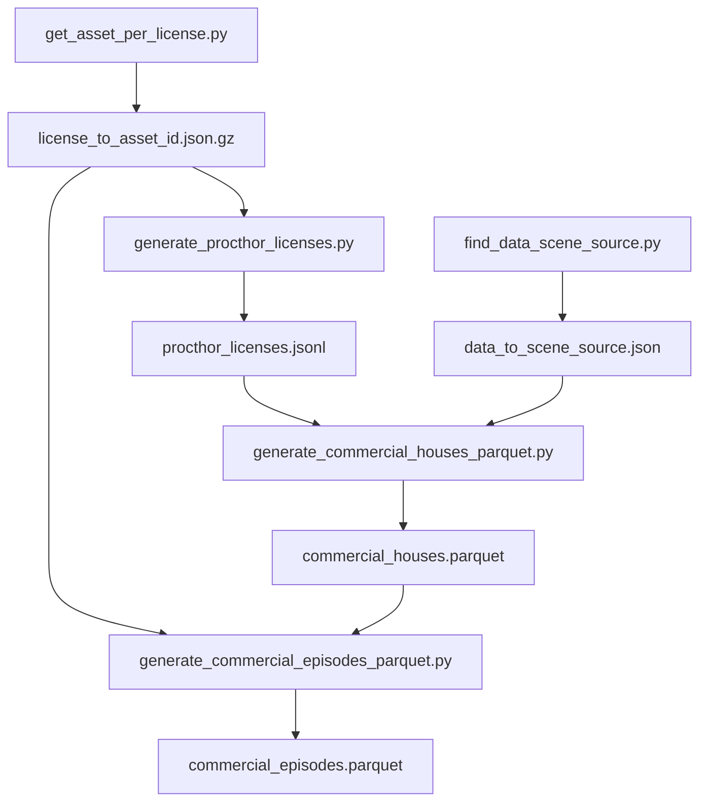

# Commercial-use episode index (`commercial_episodes.parquet`)

Scripts in this directory build parquet indexes over [`allenai/molmobot-data`](https://huggingface.co/datasets/allenai/molmobot-data) that exclude content licensed for **non-commercial use only**.

Non-commercial (NC) licenses treated as excluded:

- `by-nc` (CC BY-NC)
- `by-nc-sa` (CC BY-NC-SA)

Filtering happens at two levels:

1. **House level** (`commercial_houses.parquet`): drop ProcTHOR-Objaverse houses whose static scene objects include any NC asset; keep all iTHOR houses (CC-BY).
2. **Episode level** (`commercial_episodes.parquet`): for configs that place `added_objects` at episode time, stream each house archive and drop individual episodes whose `added_objects` reference NC assets. All other configs store `valid_episodes_string='*'` (all episodes kept).

---

## Prerequisites

### Environment

From the **repository root** (parent of `nc_data/`), install molmo_spaces with the MuJoCo extra, then add `rich` for live dashboards:

```bash
cd /weka/robots-default/jordis/molmospaces
uv pip install -e ".[mujoco]"
uv pip install rich
```

Activate whatever virtualenv you used for that install before running the pipeline steps below.

### Scene cache (`MLSPACES_CACHE_DIR`)

These scripts are intended to run against a **fully populated** molmo_spaces resource cache. On this machine that cache should already be available; point the resource manager at it before running anything:

```bash
export MLSPACES_CACHE_DIR=/path/to/your/molmo-spaces-resources
```

`MLSPACES_CACHE_DIR` is read by `molmo_spaces.molmo_spaces_constants` (default: `~/.cache/molmo-spaces-resources`). If unset or incomplete, steps will fail or produce partial results.

| Step | What it reads from cache |
|------|--------------------------|
| 1 (`get_asset_per_license.py`) | Objaverse object annotations (license metadata per asset) |
| 2 (`generate_procthor_licenses.py`) | ProcTHOR-Objaverse **train** (~100k) and **val** (~10k) scene `*_metadata.json` files under `scenes/procthor-objaverse-{train,val}/` |

Step 2 does **not** download scenes over the network; it walks the on-disk install via `get_resource_manager()`. A partial cache yields an incomplete `procthor_licenses.jsonl`, and step 4 will skip procthor houses as `procthor_missing_jsonl` until the JSONL covers every scene index referenced by the dataset.

Steps 3–5 stream house archives from Hugging Face (`allenai/molmobot-data` / `allenai/molmospaces`) and do not require local scene files, but still depend on step 1's asset license map.

To populate a cache from scratch, see [`docs/assets.md`](../docs/assets.md) (e.g. `python -m molmo_spaces.molmo_spaces_constants` with `MLSPACES_FORCE_INSTALL=True`).

You also need:

- A Hugging Face token with access to `allenai/molmobot-data` (used when streaming house tar archives in the episode step).

### Working directory and `PYTHONPATH`

Run pipeline commands from `nc_data/`. Scripts import each other from this directory and `molmo_spaces` from the parent repo, so prefix every invocation with `PYTHONPATH=..:.` and use unbuffered output (`-u`) for live logs:

```bash
cd /weka/robots-default/jordis/molmospaces/nc_data
```

All commands in this README use that prefix. Equivalent one-liner if you prefer to export once per shell:

```bash
export PYTHONPATH=..:.
alias py='python -u'
# then: py generate_procthor_licenses.py &> log_procthor_licenses &
```

### Logging long runs

For steps that take a while, run in the background and redirect stdout/stderr to a log file:

```bash
PYTHONPATH=..:. python -u SCRIPT.py [args] &> log_NAME &
```

Follow progress with `tail -f log_NAME`, or use each script's `*.dashboard.json` where available.

**Alternative (foreground + live terminal):** append `2>&1 | tee log_NAME` instead of `&> log_NAME &` if you want output on screen and in the file at once — see step 4 for an example.

---

## Pipeline overview



| Step | Script | Main output | Reads remote/H5 data? |
|------|--------|-------------|------------------------|
| 1 | `get_asset_per_license.py` | `license_to_asset_id.json.gz` | No (local object metadata) |
| 2 | `generate_procthor_licenses.py` | `procthor_licenses.json`, `procthor_licenses.jsonl` | No (local scene install) |
| 3 | `find_data_scene_source.py` | printed summary → `data_to_scene_source.json` | Yes (sampled HF pkgs) |
| 4 | `generate_commercial_houses_parquet.py` | `commercial_houses.parquet` | No (HF pkgs metadata only) |
| 5 | `generate_commercial_episodes_parquet.py` | `commercial_episodes.parquet` | Yes (streams tar/H5 per house) |

---

## Commands

### 1. Build asset → license map

```bash
PYTHONPATH=..:. python -u get_asset_per_license.py
```

Writes `license_to_asset_id.json.gz` (131k+ assets in the current run).

### 2. Classify ProcTHOR scenes by object license

Requires procthor-objaverse scenes in the resource-manager cache.

```bash
PYTHONPATH=..:. python -u generate_procthor_licenses.py &> log_procthor_licenses &
```

Defaults:

- Output: `procthor_licenses.json`
- Per-scene stream: `procthor_licenses.jsonl`
- Live dashboard: `procthor_licenses.dashboard.json`
- Splits: `train` (100k indices) and `val` (10k indices)

**Wait for this step to finish** before building `commercial_houses.parquet`. Requires a complete procthor-objaverse scene cache under `MLSPACES_CACHE_DIR` (see above). If the JSONL scan is incomplete, procthor houses are skipped as `procthor_missing_jsonl`.

Monitor progress (optional):

```bash
PYTHONPATH=..:. python -u render_dashboards.py --watch 2 procthor_licenses.dashboard.json
```

### 3. Map each dataset part to its scene source

Samples a few entries per `(config, split, part)` and majority-votes the molmospaces scene source.

```bash
PYTHONPATH=..:. python -u find_data_scene_source.py --samples 3 --seed 0 &> log_scene_sources &
```

The script prints a `SUMMARY` block at the end. Copy that into `data_to_scene_source.json` (nested: `config → split → part → scene_source string`). A committed copy already lives in this directory.

### 4. Build the commercial house index

```bash
PYTHONPATH=..:. python -u generate_commercial_houses_parquet.py &> log_houses_parquet &
```

Alternative if you want live output in the terminal while also saving a log (runs in the foreground):

```bash
PYTHONPATH=..:. python -u generate_commercial_houses_parquet.py 2>&1 | tee log_houses_parquet
```

Defaults:

- Input: `procthor_licenses.jsonl`, `data_to_scene_source.json`
- Output: `commercial_houses.parquet`
- Splits: `train` and `val`
- All nine `TASK_CONFIGS` in `episode_license_info.py`

Keeps a house when:

- **iTHOR**: always kept.
- **procthor-objaverse**: kept only if `nc_object_count == 0` in the JSONL for that `(split, scene_idx)`.

### Debug only: which configs use `added_objects`?

**Not required for the production pipeline.** Step 5 below already hardcodes the answer.

`probe_added_objects.py` was used once during development to discover which task configs place objects via `task_config.added_objects` at episode time (those are the only configs that need slow per-episode H5 streaming). It samples a few random houses per `(config, split, part)`, streams tar/H5, and reports which configs saw non-empty `added_objects`.

The probe result was baked into `generate_commercial_episodes_parquet.py` as `DEFAULT_CONFIGS_REQUIRING_EPISODE_CHECK`. Re-running the probe is only useful to **verify** that list after dataset changes, or to **regenerate** it if new configs are added.

```bash
# Debug / verification only — skip for normal builds
PYTHONPATH=..:. python -u probe_added_objects.py --from-pkgs --samples-per-group 3 --output added_objects_probe.json
```

To use fresh probe output instead of the hardcoded defaults (also debug-only):

```bash
PYTHONPATH=..:. python -u generate_commercial_episodes_parquet.py --probe-json added_objects_probe.json ...
```

Or override individual configs with repeated `--episode-check-config CONFIG`.

Hardcoded configs (from the original probe; used by step 5 by default):

- `FrankaPickAndPlaceColorOmniCamConfig`
- `FrankaPickAndPlaceOmniCamConfig`
- `FrankaPickAndPlaceOmniCamConfig_ObjectBackfill`
- `RBY1PickAndPlaceDataGenConfig`

All other configs get `valid_episodes_string='*'` without opening house archives.

### 5. Build the commercial episode index (slow step)

This streams each house archive from Hugging Face only for the four configs above; it can take many hours.

```bash
PYTHONPATH=..:. python -u generate_commercial_episodes_parquet.py --dashboard --workers 8 &> log_commercial_episodes &
```

Defaults:

- Input: `commercial_houses.parquet`, `license_to_asset_id.json.gz`
- Output: `commercial_episodes.parquet`
- Live dashboard: `commercial_episodes.dashboard.json`
- Episode-check config set: hardcoded defaults (see debug section above); no `--probe-json` needed
- Workers: `1` (serial). Pass `--workers 8` (or similar) to parallelize range downloads for check configs; wildcards stay on the main thread. `--resume` and `--dashboard` work unchanged.

Monitor progress (optional):

```bash
PYTHONPATH=..:. python -u render_dashboards.py --watch 2 commercial_episodes.dashboard.json
```

#### Resuming after interrupt

The episode step supports append-only resume. If a run fails (e.g. network error while streaming a shard), restart with:

```bash
PYTHONPATH=..:. python -u generate_commercial_episodes_parquet.py --dashboard --resume --workers 8 &> log_commercial_episodes_resumeN &
```

`--resume` skips houses whose `(config, split, path)` are already present in the output parquet and appends the rest. Safe to re-run on the same output file.

---

## Output schema (`commercial_episodes.parquet`)

One row per commercial house from `commercial_houses.parquet`:

| Column | Meaning |
|--------|---------|
| `config`, `split`, `part`, `entry_index`, `path`, `shard_id`, `offset`, `size` | Same pkgs locator fields as the house index |
| `scene_id`, `scene_idx`, `scene_family` | Scene identity |
| `valid_episodes_string` | `'*'` = all episodes OK; otherwise comma-separated 0-based episode ordinals to keep; empty string = no valid episodes |
| `episodes_total` | Total episodes in archive (`-1` for wildcard rows) |
| `episodes_discarded_nc` | Episodes dropped for NC `added_objects` (`-1` for wildcard rows) |

To use the index: keep episode ordinal `i` iff `valid_episodes_string == '*'` or `i` appears in the comma-separated list.

---

## Auxiliary scripts

| Script | Purpose |
|--------|---------|
| `probe_added_objects.py` | **Debug only:** sample houses to see which configs use `added_objects` (outcome already hardcoded in step 5) |
| `episode_license_info.py` | Shared HF streaming / scene-resolution utilities |
| `render_dashboards.py` | Terminal UI for `*.dashboard.json` files |
| `scene_meta_example.py` | Small example for reading scene metadata |

---

## Notes

- Step 4 only needs Hugging Face **dataset metadata** (fast). Step 5 downloads compressed house archives over HTTP and is the long pole (~10–20+ hours depending on network and how many pick-and-place houses need checking).
- Re-run step 4 after step 2 completes if an earlier houses build used a partial `procthor_licenses.jsonl`.
- Logs in this directory (`log_*`) record prior runs and are useful for comparing ETAs and resume checkpoints.
